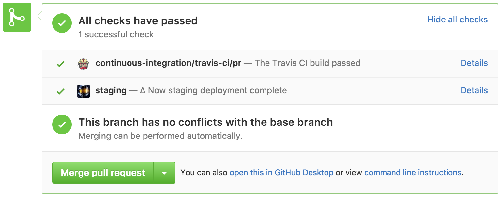

# now-travis

Automatically deploy to ∆ Now from Travis pushes. Setting up now-travis can:

- Automatically create staging deployments for pull requests
- Automatically deploy and alias upon pushes to master

Warning: Using now-travis has the potential to create many deployments, enough to blow
through the allotment on the Free plan. It is recommended to only use this on the Pro or
Enterprise accounts.

## Setup

In order to use now-travis on a repository, you'll need some keys to authorize it to execute
actions in Travis. The following set up will walk you through this process.

First, you'll need to create a [New personal access token](https://github.com/settings/tokens/new). Give
the token a name, and check the `repo` scope checkbox. This will only be used to set the status on pull requests
with a ∆ Now URL. Be sure to keep this key ready to paste into an upcoming command.

Second, head over to [Zeit's API tokens page](https://zeit.co/account#api-tokens) and create a new token. This
will be used to create deployments during pull requests and master pushes.

If your repository doesn't have a `.travis.yml` file, create an empty one now in the root of the repo.
 
Now we need to encrypt the API keys we generated into the `.travis.yml` file. This is done using a CLI tool. You can
either install the [travis-ci tool](https://github.com/travis-ci/travis.rb) or the [travis-encrypt npm tool](https://www.npmjs.com/package/travis-encrypt)
for encrypting these values.

If you are using the travis-ci tool, execute the following command in your terminal, substituting `<owner>`, `<repo_name>`,
`<gh_key>`, and `<now_key>` with the appropriate values:

```sh
travis encrypt -r <owner>/<repo_name> GH_TOKEN=<gk_key> NOW_TOKEN=<now_key> --add
```

If you are using the travis-encrypt tool from npm, execute the following command in your terminal, substituting `<owner>`, `<repo_name>`,
`<gh_key>`, and `<now_key>` with the appropriate values: 

```sh
travis-encrypt --add -r <owner>/<repo_name> GH_TOKEN=<gk_key> NOW_TOKEN=<now_key>
```

Your API keys are now encrypted in your `.travis.yml` file. Next, install now-travis in your project:

```sh
# Execute if using npm
npm install --save-dev now-travis

# Execute this instead if you are using yarn
yarn add --dev now-travis
```

Let's edit the `.travis.yml` file to automate deployments:

1. Add `after_script` to execute now-travis after the build is done and successful. If you use an alias for
your production deployments, add that to the `NOW_ALIAS` environment variable:

```yaml
after_script:
  - NOW_ALIAS=myalias.com node_modules/.bin/now-travis
```

2. Add `branches` to ensure we only create production deployments when pushing to the master branch:

```yaml
branches:
  only:
    - master
```

## Deployment

When creating pull requests after a Travis build has been successfully completed, now-travis will create a ∆ Now deployment
and update the pull request with the staging URL:



Clicking on the "Details" link will open the page to the staging deployment URL.

## Notes

While this module has been tested, it may not work perfectly in every Travis deployment situation. Please test
it out and report any issues that may arise.

Again, this package has the ability to create many deployments, potentially more than your Zeit plan allots. Please
exercise judgement when installing this. By default, following these instructions for now-travis will create a deployment:

- When a pull request is opened
- When a pull request is re-opened
- When a new commit is pushed to a pull request
- When a commit is pushed to the master branch
